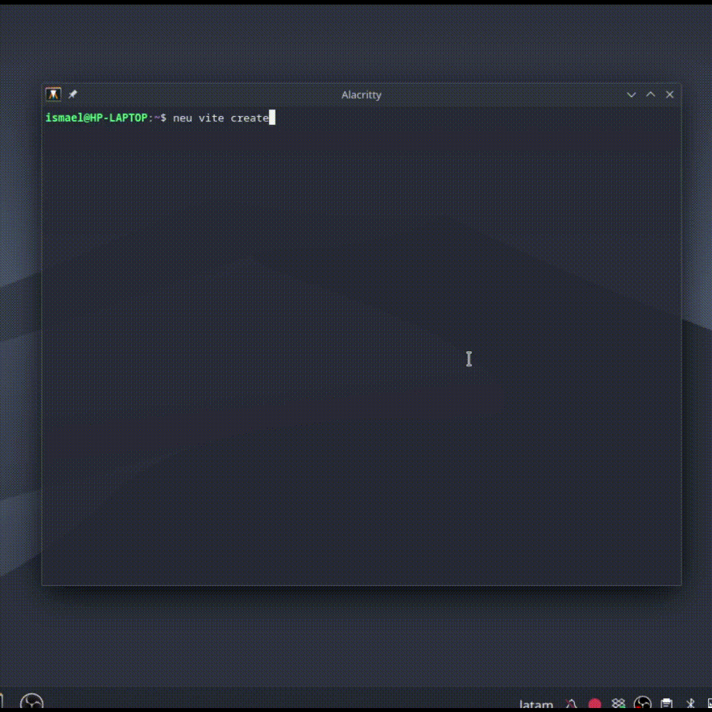

# NeutralinoJS Vite Plugin

  

> [!CAUTION]
> This plugin is still under active development. Future updates may introduce breaking changes or compatibility issues.

A [`neu-cli`](https://neutralino.js.org/docs/cli/neu-cli) plugin that integrates [Vite](https://vitejs.dev/) into your [NeutralinoJS](https://neutralino.js.org/) projects. Create and develop lightweight, cross-platform desktop applications using your favorite frontend framework with hot module replacement (HMR) support.

## Features

- 🚀 **Fast Development** - Vite's lightning-fast HMR for instant feedback
- 🎨 **Multiple Frameworks** - Support for React, Vue, Svelte, Solid, Preact, Lit, Qwik, and SvelteKit
- 📦 **Easy Setup** - Interactive project creation wizard
- 🔧 **TypeScript Support** - First-class TypeScript support for all frameworks

## Installation

Install the plugin using the `neu` CLI:

```bash
neu plugins --add neutralinojs-plugin-vite
```

## Usage

This plugin extends the `neu` CLI with the `vite` command. All commands are executed using:

```bash
neu vite <command>
```

### Creating a New Project



To create a new NeutralinoJS project with Vite integration, run:

```bash
neu vite create
```

This will start an interactive wizard that guides you through the project setup:

1. **Project name** - Enter your project name (default: `neutralinojs-vite-app`)
2. **Framework selection** - Choose from available frameworks:
   - **React** - TypeScript, JavaScript, SWC, React Compiler variants
   - **Vue** - TypeScript or JavaScript
   - **Svelte** - TypeScript, JavaScript, or SvelteKit
   - **Solid** - TypeScript or JavaScript
   - **Preact** - TypeScript or JavaScript
   - **Lit** - TypeScript or JavaScript
   - **Qwik** - TypeScript or JavaScript
3. **Install dependencies** - Optionally install dependencies after creation
4. **Run the app** - Optionally run the application after creation (like `neu vite dev`)

### Running the Development Server


To start the Vite development server with NeutralinoJS:

```bash
neu vite dev
```

This command will:
1. Verify your NeutralinoJS setup
2. Start the Vite development server with HMR
3. Launch the NeutralinoJS application window

## Project Structure

After creating a project, you'll have the following structure:

```
my-project/
├── neutralino.config.json    # NeutralinoJS configuration
├── vite-src/                 # Vite project source
│   ├── src/                  # Your application source code
│   ├── public/               # Static assets
│   ├── dist/                 # Built files (generated)
│   └── vite.config.ts        # Vite configuration
└── extensions/               # NeutralinoJS extensions
```

> [!NOTE]  
> The contents inside `vite-src/` may vary depending on the framework you selected during project creation.

## Configuration

### Vite Configuration

You can customize Vite by editing the `vite.config.ts` (or `vite.config.js`) file inside the `vite-src/` directory.

For more details, refer to the [official Vite documentation](https://vite.dev/config/).

### NeutralinoJS Configuration

Configure your NeutralinoJS application by editing the `neutralino.config.json` file in your project root. This file controls:

- Window properties (size, title, resizable, etc.)
- Native API permissions
- Application metadata
- Build settings

For a complete list of options, check the [official NeutralinoJS documentation](https://neutralino.js.org/docs/configuration/neutralino.config.json/).

#### Vite-specific Configuration

The plugin adds a `vite` section under `cli` in `neutralino.config.json`:

```json
{
  "cli": {
    "vite": {
      "projectPath": "/vite-src/"
    }
  }
}
```

## Requirements

- Node.js >= 16
- [neu-cli](https://neutralino.js.org/docs/cli/neu-cli) installed globally

## License

This project is licensed under the MIT License.