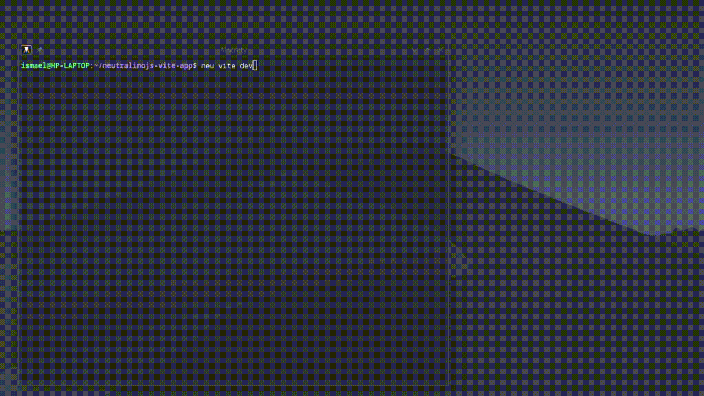

# Development Server

`neu vite dev` is your day-to-day command. It wires a Vite dev server and the NeutralinoJS runtime together so edits show up instantly in the native window.

```bash
neu vite dev
```



| Flag | Description |
|---|---|
| `--arch <arch>` | Force the NeutralinoJS architecture instead of `process.arch` (e.g. `x64`, `arm64`, `armhf`) |

## Pre-flight checks

Before starting anything, the plugin runs a doctor pass and aborts with exit code `1` if something is missing:

- `neutralino.config.json` exists in the current directory.
- The [Vite project](./existing-project.md) configured at `cli.vite.projectPath` exists on disk.
- Its dependencies are installed (`node_modules/` present).
- `vite` itself is installed in that project.
- Your platform (`linux`, `darwin`, `win32`) is supported.
- Your architecture has a NeutralinoJS binary available.
- The binary actually exists under `bin/` — otherwise it suggests running `neu update`.

Each failing line prints its own fix hint, so most issues resolve themselves by following the output.

## What gets started

Once the checks pass, three things come up:

1. **The Vite dev server** — loaded directly from *your* project's `vite` dependency, rooted at the Vite project directory. It respects your `vite.config.*` (port defaults to 5173) and gets one extra middleware injected: an **auth proxy**.
2. **A NeutralinoJS instance per window** — each app window runs through `neu run` with:
   - a random free port for NeutralinoJS's internal server,
   - the Vite URL as the window target, tagged with a unique session id (`neutralinoViteUid`).
3. **The app window itself**, launched through your configured [package manager runner](../reference/configuration.md#clivitepackagemanager).

### Why the auth proxy?

NeutralinoJS serves `/__neutralino_globals.js` from its own port, and those bindings only work for the matching instance. The injected middleware gives every window a cookie with its session id and proxies that file to the right port behind the scenes. This is what lets you run **several app windows at once** against the same dev server without them stealing each other's sessions.

## In-session keyboard commands

While `neu vite dev` is running:

| Key | Action |
|---|---|
| <kbd>r</kbd> | Send a full reload to every connected app window |
| <kbd>o</kbd> | Open another app window against the same dev server |
| <kbd>Ctrl+C</kbd> | Stop the dev server and exit |

> [!TIP]
> HMR updates apply automatically as you save files. Use <kbd>r</kbd> when you change something HMR can't hot-swap, or after tweaking `neutralino.config.json` settings.

## Logs

NeutralinoJS process output is appended to log files at the **project root**:

- `neu-cli.log` — stdout
- `neu-cli.err.log` — stderr

Both are covered by the generated `.gitignore` (`*.log`).
